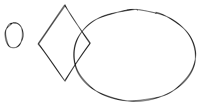

# interview

#### Redis持久化方案aof的默认fsync时间是多长? <a href="#redis-chi-jiu-hua-fang-an-aof-de-mo-ren-fsync-shi-jian-shi-duo-chang" id="redis-chi-jiu-hua-fang-an-aof-de-mo-ren-fsync-shi-jian-shi-duo-chang"></a>


#### Redis的过期失效机制? <a href="#redis-de-guo-qi-shi-xiao-ji-zhi" id="redis-de-guo-qi-shi-xiao-ji-zhi"></a>

> Redis过期键删除使用惰性删除(消极删除)和定时删除(积极删除)两种策略来删除过期键,
>
> 惰性删除就是一旦访问到过期键(所有的读写数据库的命令,set,lrange,sadd,hget,keys 等等),expireIfNeeded函数先判断键是否过期,如果过期就删除,没有过期就正常返回!
>
> 定时删除就是activeExpireCycle 函数被调用,规定时间内,分多次遍历服务器中的各个数据库,从数据库的expires字典中随机检查一部分键的过期时间,并删除其中的过期键

<details>

<summary>东阁哥给法国</summary>

dddddddddddddffffffffffffffffffffffffffffffffffffffffffffffffffffffffffffffff反反复复反反复复反反复复反反复复反反复复反反复复反反复复反反复复吩咐

</details>



```
惰性清除。在访问key时，如果发现key已经过期，那么会将key删除。

定时清理。Redis配置项hz定义了serverCron任务的执行周期，默认每次清理时间为25ms，每次清理会依次遍历所有DB，从db随机取出20个key，如果过期就删除，如果其中有5个key过期，那么就继续对这个db进行清理，否则开始清理下一个db。

当执行写入命令时，如果发现内存不够，那么就会按照配置的淘汰策略清理内存，淘汰策略主要由以下几种
```



* aof文件比rdb更新的频率高,优先使用aof还原数据
* aof比rdb更安全也更大
* rdb性能比aof好
* 如果两个都配了优先加载aof

